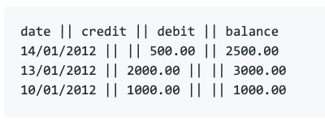

# BANK TECH TEST

## Description
This project is a practice of doing tech tests.

### Requirements
* You should be able to interact with your code via a REPL like IRB or the JavaScript console. (You don't need to implement a command line interface that takes input from STDIN.)
* Deposits, withdrawal.
* Account statement (date, amount, balance) printing.
* Data can be kept in memory (it doesn't need to be stored to a database or anything).

### Acceptance criteria

__Given__ a client makes a deposit of 1000 on 10-01-2012

__And__ a deposit of 2000 on 13-01-2012

__And__ a withdrawal of 500 on 14-01-2012

__When__ she prints her bank statement

__Then__ she would see:

